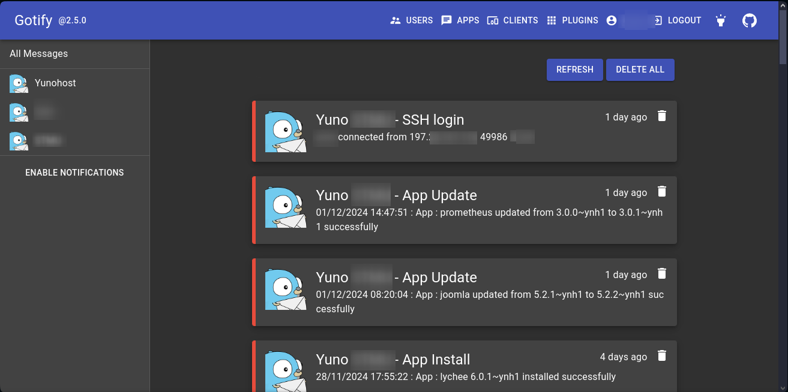

<!--
To README zostało automatycznie wygenerowane przez <https://github.com/YunoHost/apps/tree/master/tools/readme_generator>
Nie powinno być ono edytowane ręcznie.
-->

# Yuno_Goti_Notify dla YunoHost

[](https://ci-apps.yunohost.org/ci/apps/yuno_goti_notify/)


[](https://install-app.yunohost.org/?app=yuno_goti_notify)

*[Przeczytaj plik README w innym języku.](./ALL_README.md)*

> *Ta aplikacja pozwala na szybką i prostą instalację Yuno_Goti_Notify na serwerze YunoHost.*  
> *Jeżeli nie masz YunoHost zapoznaj się z [poradnikiem](https://yunohost.org/install) instalacji.*

## Przegląd

# Yunohost_Gotify_Notifications
A collection of Yunohost hooks to send notifications to a Gotify server

## Functions :
  * Get notified after adding a domain
  * Get notified after removing a domain
  * Get notified after a certificate update
  * Get notified after a backup is finished
  * Get notified after a restore is finished
  * Get notified after an app is installed
  * Get notified after an app is removed
  * Get notified after an app is updated
  * Get notified when a successful ssh connection is established


**Dostarczona wersja:** 0.1~ynh1

## Zrzuty ekranu



## Dokumentacja i zasoby

- Oficjalna dokumentacja: <https://github.com/DeMiro5001/Yunohost_Gotify_Notifications/blob/main/README.md>
- Oficjalna dokumentacja dla administratora: <https://github.com/DeMiro5001/Yunohost_Gotify_Notifications/blob/main/README.md>
- Repozytorium z kodem źródłowym: <https://github.com/DeMiro5001/Yunohost_Gotify_Notifications>
- Sklep YunoHost: <https://apps.yunohost.org/app/yuno_goti_notify>
- Zgłaszanie błędów: <https://github.com/YunoHost-Apps/yuno_goti_notify_ynh/issues>

## Informacje od twórców

Wyślij swój pull request do [gałęzi `testing`](https://github.com/YunoHost-Apps/yuno_goti_notify_ynh/tree/testing).

Aby wypróbować gałąź `testing` postępuj zgodnie z instrukcjami:

```bash
sudo yunohost app install https://github.com/YunoHost-Apps/yuno_goti_notify_ynh/tree/testing --debug
lub
sudo yunohost app upgrade yuno_goti_notify -u https://github.com/YunoHost-Apps/yuno_goti_notify_ynh/tree/testing --debug
```

**Więcej informacji o tworzeniu paczek aplikacji:** <https://yunohost.org/packaging_apps>
